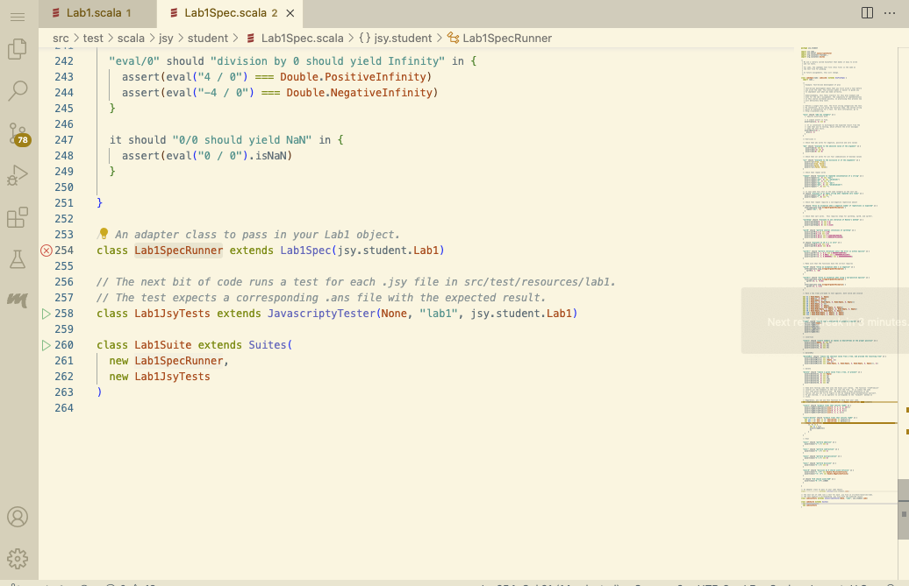
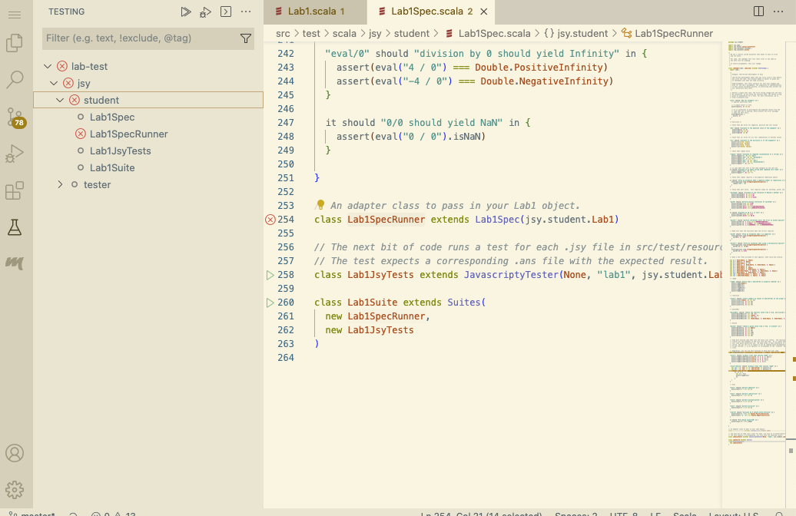

# Principles and Practice in Programming Languages
# Lab 1

This repository contains the student project files. If you are an instructor looking to re-use these materials, please contact me ([Bor-Yuh Evan Chang](https://plv.colorado.edu/bec)).

Refer to the lab handouts for details about each assignment (i.e., `lab1.pdf` for Lab 1). This file provides some information to help you get started with setting up your development environment.

## Integrity of the Course Materials

The development effort in the course materials, including these lab assignments, the exercises, and the exams, is significant. You agree that you will not share any course materials publicly. The course materials, include your or anyone else's solutions to the lab assignments, exercises, and exams. In particular, you agree not to post your solutions to the lab assignments in a public source code repository, such as public Github repositories. Please use private source code repositories for your work.

## Repository Organization

In the directory that you want your project files, clone this repository to your local machine. You can determine the clone URL by clicking the `Code` button in the GitHub interface.

    $ git clone <your .git URL>

In this document, the

    $

simply stands for the shell prompt.

The above command will create the directory `pppl-lab1`.

    $ cd pppl-lab1

All other commands in this document will assume that your are in this directory.

Note that the files for a single lab are committed on different branches in the repository.

## Project Files Organization

For Lab 1, the most important project files are shown below.

```
.
├── README.md  (this file)
├── lab1.pdf   (the lab handout)
├── lab1.sh    (run your Javascripty intepreter)
├── src
│   ├── main
│   │   └── scala
│   │       └── jsy
│   │           ├── lab1                 (lab-specific support files will here)
│   │           │   ├── Lab1Like.scala      (the Lab1 interface)
│   │           │   ├── Parser.scala        (the Javascripty parser)
│   │           │   └── ast.scala           (the Javascripty AST classes)
│   │           ├── student              (files for you to edit will be here)
│   │           │   ├── Lab1.scala          (implementation template to **submit**)
│   │           │   └── Lab1.worksheet.sc   (a scratch worksheet)
│   │           └── util
│   └── test
│       ├── resources
│       │   └── lab1    (test .jsy files with expect answers in .ans)
│       │       ├── test101_arith.ans
│       │       ├── test101_arith.jsy
│       │       ├── test102_divbyzero.ans
│       │       └── test102_divbyzero.jsy
│       └── scala
│           └── jsy
│               ├── student
│               │   └── Lab1Spec.scala     (your ScalaTest tests)
│               └── tester
│                   └── JavascriptyTester.scala
└── testlab1.sh  (run your Lab1 tests in Lab1Spec.scala)
```

The files for you to edit and submit will be in `src/main/jsy/student` or `src/test/scala/jsy/student`.

## Prerequisites

The current version of project has been tested with the following:

- [Scala](https://scala-lang.org/download/) 2.13 on [Java](https://www.oracle.com/java/technologies/downloads/) 11 (Oracle or OpenJDK)

You may follow the installation instructions from the above links or use your platforms package manager (e.g., [Homebrew](https://brew.sh/) on macOS).

For working with on the lab projects, you don't have to install Scala directly. Installing [sbt](https://www.scala-sbt.org/) is sufficient to automatically download the appropriate Scala version.

## Scala Development Tools

For this course, we are supporting the use of [VS Code](https://code.visualstudio.com/) with [Metals](https://scalameta.org/metals/), a Scala build server.

You are welcome to use any development environment, but we may not be able answer questions in your particular environment. Another commonly used development environment for Scala is [IntelliJ IDEA](https://www.jetbrains.com/idea/).

You can install Metals through the [Marketplace](https://marketplace.visualstudio.com/items?itemName=scalameta.metals) or from the Extensions tab within VS Code.

Note that Metals may complain if it cannot find Java 11. It may prompt you to install Java 11; accepting this will download and install it for Metals specifically.

### Opening the Project

The most important key combination is accessing VS Code's [Command Palette](https://code.visualstudio.com/docs/getstarted/tips-and-tricks#_command-palette).
When referring to VS Code operations, we use the command name that you can find using the Command Palette, such as opening a folder.

    > File: Open Folder...

You can also start a terminal window within VS Code with

    > Terminal: Create New Terminal

to follow any of the terminal commands above (e.g., to `git clone` a repo). This is particularly useful when using a browser-based instance of VS Code.

Open the `pppl-lab1` project folder in VS Code. Metals should start automatically, and it may prompt you to import the sbt build after start up. You can click `Import build`. If you skipped importing the build earlier, you can use

    > Metals: Import build

Importing the build may take some time. This is normal.

Now you can open `src/main/scala/jsy/student/Lab1.scala` and `src/test/scala/jsy/student/Lab1Spec.scala`. It is convenient to use [Quick Open](https://code.visualstudio.com/docs/getstarted/tips-and-tricks#_quick-open) to open `Lab1.scala` or `Lab1Spec.scala` from within the directory structure without typing paths or navigating in the Explorer pane.

### Command-Line Tools

While not strictly required, you will also want to be able to use the command-line tools.

You can issue the following command to compile your code:

    $ sbt compile

This command

    $ sbt clean

deletes the previous compilation.

It is most convenient to run sbt interactively

    $ sbt

and then run via

    > compile

at the sbt prompt. The slow load time of sbt is due to starting a JVM instance, which is saved by starting it once and re-using the instance for several operations. In the following, we will show sbt commands from the sbt prompt as above.

In sbt, you can also prefix any command with `~` to re-execute the command when any file in the project is updated.

    > ~compile

### Scala Interactive Console

From sbt, you can start the Scala console using the command

    > console

and can import the functions in your lab in the following way

    scala> import jsy.student.Lab1._

## ScalaTest

We will be using the [ScalaTest](http://www.scalatest.org/) framework for testing.  Using this framework, we practice test-driven development (TDD), a standard practice in industry. You do not need to explicitly download ScalaTest.

Once some of the project is implemented, naturally you want to test its functionality and correctness.
We provide some unit tests in `Lab1Spec.scala` to drive your implementation.  You can also run all test objects under the `src/test` directory via

    > test

at the sbt prompt. Or you can specify, specifically

    > testOnly jsy.student.Lab1SpecRunner
    
In VS Code, this can be done in the GUI (or with a VS Code terminal window using the command-line tools).

#### VS Code Testing UI

Open `Lab1Spec.scala`. Then, a green triangle is visible next to each test class's definition (e.g., `Lab1JsyTests`) that have not run.
Clicking this will build and run the tests in that class.



Alternatively, the Testing View (via `> View: Show Testing`) provides a hierarchical menu for running the tests in the project.



## Your Javascripty Interpreter

You can run your Javascripty interpreter with a file (e.g., tests in `src/test/resources`) from sbt or the command-line:

    > runMain jsy.student.Lab1 <arguments>

Or for your convenience,

    $ ./lab1.sh <arguments>

However, it might be less common that you will want to run your Javascripty interpreter directly, as you will be driving the completion of your implementation through tests in `Lab1Spec.scala`.

## Node.js

We have a script to run Javascripty files through Node.js (as JavaScript):

    $ ./jsy.sh test.jsy

## Troubleshooting

### What if I can't run tests?

If you run into issues with running the project, a common issue is using an incompatible Java version. Check that you are using Java 11.

If the issue is running within VS Code, check your [Metals: Java Home](https://scalameta.org/metals/docs/editors/vscode#configure-java-version) setting.

If you have another version of Java installed, you may be able to use [jEnv](https://www.jenv.be) or [Jabba](https://github.com/shyiko/jabba) to manage your installed JDK versions and to switch between them.
