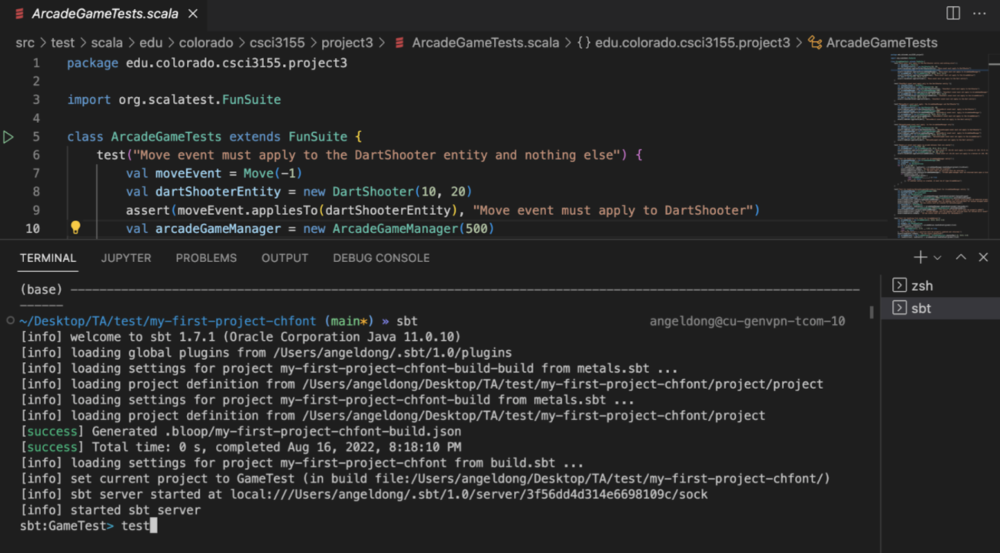
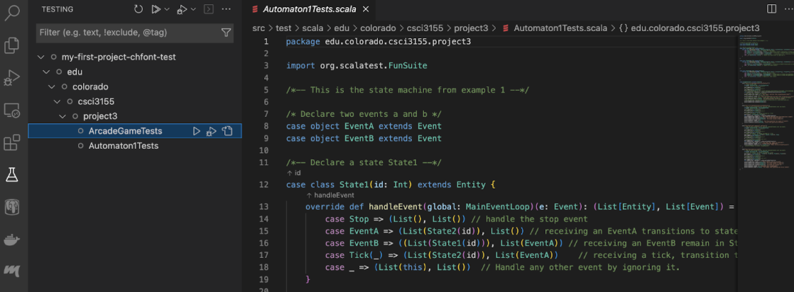
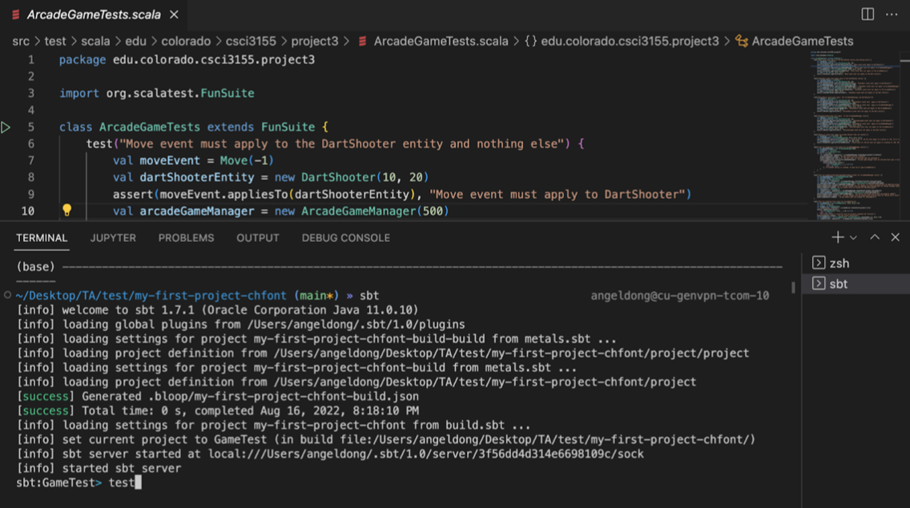

# Principles and Practice in Programming Languages
# Lab 1

This repository contains the student project files. If you are an instructor looking to re-use these materials, please contact me ([Bor-Yuh Evan Chang](https://plv.colorado.edu/bec)).

Refer to the lab handouts for details about each assignment (i.e., `lab1.pdf` for Lab 1). This file provides some information to help you get started with setting up your development environment.

## Integrity of the Course Materials

The development effort in the course materials, including these lab assignments, the exercises, and the exams, is significant. You agree that you will not share any course materials publicly. The course materials, include your or anyone else's solutions to the lab assignments, exercises, and exams. In particular, you agree not to post your solutions to the lab assignments in a public source code repository, such as public Github repositories. Please use private source code repositories for your work.

## Repository Organization

In the directory that you want your project files, clone this repository to your local machine. You can determine the clone URL by clicking `Clone or download` in the Github
interface.

    $ git clone <your .git URL>

In this document, the

    $

simply stands for the shell prompt.

The above command will create the directory `pppl-lab1`.

    $ cd pppl-lab1

All other commands in this document will assume that your are in this directory.

Note that the files for a single lab are committed on different branches in the repository.

## Project Files Organization

For Lab 1, the most important project files are shown below.

```
.
├── README.md  (this file)
├── lab1.pdf   (the lab handout)
├── lab1.sh    (run your Javascripty intepreter)
├── src
│   ├── main
│   │   └── scala
│   │       └── jsy
│   │           ├── lab1                 (lab-specific support files will here)
│   │           │   ├── Lab1Like.scala      (the Lab1 interface)
│   │           │   ├── Parser.scala        (the Javascripty parser)
│   │           │   └── ast.scala           (the Javascripty AST classes)
│   │           ├── student              (files for you to edit will be here)
│   │           │   ├── Lab1.scala          (implementation template to **submit**)
│   │           │   └── Lab1Worksheet.sc    (a scratch worksheet)
│   │           └── util
│   └── test
│       ├── resources
│       │   └── lab1    (test .jsy files with expect answers in .ans)
│       │       ├── test101_arith.ans
│       │       ├── test101_arith.jsy
│       │       ├── test102_divbyzero.ans
│       │       └── test102_divbyzero.jsy
│       └── scala
│           └── jsy
│               ├── student
│               │   └── Lab1Spec.scala     (your ScalaTest unit tests)
│               └── tester
│                   └── JavascriptyTester.scala
└── testlab1.sh  (run your Lab1Spec)
```

The files for you to edit and submit will be in `src/main/jsy/student` or `src/test/scala/jsy/student`.
## Installing Java, Scala

### Java
You'll need to sign up with your university email into oracle (it's free) to download the jdk.

For installing Java, see https://www.oracle.com/br/java/technologies/javase/jdk11-archive-downloads.html
Installation Guide:
- Linux:https://docs.oracle.com/en/java/javase/11/install/installation-jdk-linux-platforms.html#GUID-737A84E4-2EFF-4D38-8E60-3E29D1B884B8
- MacOS: https://docs.oracle.com/en/java/javase/11/install/installation-jdk-macos.html#GUID-2FE451B0-9572-4E38-A1A5-568B77B146DE
- Windows: https://docs.oracle.com/en/java/javase/11/install/installation-jdk-microsoft-windows-platforms.html#GUID-A7E27B90-A28D-4237-9383-A58B416071CA


### Scala
Go to https://scala-lang.org, and follow installation instructions. You may need to restart after installation. (So the path variable updates).

Scala Version: 2.13.6

Java Version: 11

You can check whether Scala is successfully installed by entering `scala -version` inside the terminal. Don’t worry if it’s not 2.13.6 exactly, the project should take care of running the correct scala version


## Scala Development Tools

For this course, we are supporting the use of VS Code + Metals, a Scala build server.

- Go to https://code.visualstudio.com/ and follow instructions there to install VS Code. 
- The Metals extension (https://marketplace.visualstudio.com/items?itemName=scalameta.metals) can be installed in VS Code, from the extensions tab on the left.

Note: Metals may complain if it cannot find Java 11. It may prompt you to install Java 11, accepting this will download and install it for Metals specifically.

Alternatively, you can install JDK 11 manually, see the following section.

Setup Guides for vs code:
- Linux Guide: https://code.visualstudio.com/docs/setup/linux
- MacOS Guide: https://code.visualstudio.com/docs/setup/mac
- Windows Guide: https://code.visualstudio.com/docs/setup/windows

### Opening the Project

Opening a scala project in VS Code, Metals should start automatically, and may prompt you to import the sbt build. If Metals does not start, you can manually start it from the Metals tab on the leftmost pane (will appear under the extension tab if Metals is installed).

In VS Code, open the `pppl-lab1` folder, and Metals should prompt you, as mentioned above. Alternatively, you could build from the terminal, by opening a terminal in VS Code and entering `sbt`. This opens an interactive prompty, where `compile` will build the project, `test` will run tests, and `console` will open a Scala REPL, where you can interactively import and run your code.

Importing the build may take a long time, this is normal.

### Testing Code

Once some of the project is implemented, naturally you want to test its functionality and correctness. In VS Code, this can either be done in the GUI, or through a terminal.

#### GUI:
- Opening a test suite file, a green triangle is visible next to each suite's definition. Clicking this will build and run the tests.

- Alternatively, on the left pane of VS Code, there is a beaker icon, which provides a menu for running the tests.


#### Terminal
- To test code from a terminal, simply run `sbt test`, to build and run all tests. Like the GUI, this will report which tests pass/fail.


### Command-Line Tools

While not strictly required, you will also want to be use the command-line tools.

You can issue the following command to compile your code:

    $ sbt compile

This command

    $ sbt clean

deletes the previous compilation.

It is most convenient to run sbt interactively

    $ sbt

and then run via

    > compile

at the sbt prompt. The slow load time of sbt is due to starting a JVM instance, which is saved by starting it once and re-using the instance for several operations. In the following, we will show sbt commands from the sbt prompt as above.

In sbt, you can also prefix any command with `~` to re-execute the command when any file in the project is updated.

    > ~compile

### Scala Interactive Console

From sbt, you can start the Scala console using the command

    > console

and can import the functions in your lab in the following way

    scala> import jsy.student.Lab1._

In VS Code, you can start a terminal by going to Terminal -> New Terminal.

## ScalaTest

We will be using the [ScalaTest](http://www.scalatest.org/) framework for unit testing.  Using this framework, we practice test-driven development (TDD), a standard practice in industry. You do not need to explicitly download ScalaTest.

We provide some unit tests in `src/test/scala/Lab1Spec.scala` to drive your implementation.  To run tests, right-click on the Lab1Suite object in the Project view and select

    Run 'Lab1Suite'

You can also run all test objects under the `src/test` directory via

    > test

Or you can specify, specifically

    > test-only Lab1Suite

## Your Javascripty Interpreter

You can run your Javascripty interpreter with a file (e.g., tests in `src/test/resources`) from sbt or the command-line:

    > runMain jsy.student.Lab1 <arguments>

Or for your convenience,

    $ ./lab1.sh <arguments>

However, it is rare that you will want to run your Javascripty interpreter directly, as you will driving your implementation via tests in `Lab1Spec`.

## Node.js

We have a script to run Javascripty files through Node.js (as JavaScript):

    $ ./jsy.sh test.jsy


## Troubleshooting

NOTE: If you run into issues with running the project, check that you are using Java 11, as this is a common issue. If you have another version of Java installed, you can use Jabba (https://github.com/shyiko/jabba) on Windows, or jEnv (https://www.jenv.be/) to manage JDK versions installed, and switch between your system’s or JDK 11.
